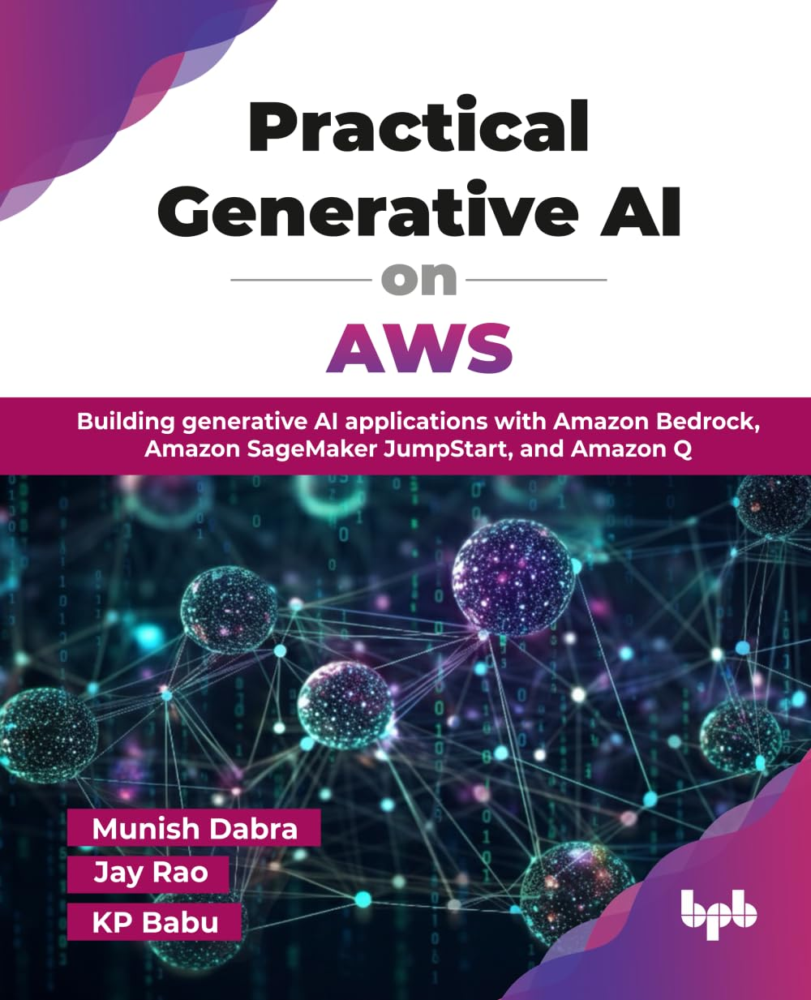

# Practical Generative AI on AWS

<div align="center">
  
</div>

**Building generative AI applications with Amazon Bedrock, Amazon SageMaker JumpStart, and Amazon Q**

By Munish Dabra, Jay Rao, and KP Babu  
Published by BPB Publications

## 📚 About This Book

GenAI is one of the most transformative technologies of our time, fundamentally changing how we build software and solve business problems. Unlike traditional AI that analyzes data to make predictions or classifications and usually requires training separate models for each specific task, GenAI provides powerful pre-trained models that can generate entirely new content from text and code to images and audio, while understanding context and responding to diverse prompts without additional training.

This repository contains the complete code examples and resources for **"Practical Generative AI on AWS"** - your comprehensive guide to navigating AWS's complete GenAI ecosystem and building intelligent applications that deliver real business value. The book covers the spectrum of AWS GenAI services like Amazon Bedrock for managed foundation models, Amazon SageMaker JumpStart for flexible ML development, and Amazon Q for business and developer productivity.

You will learn essential techniques from prompt engineering and systematic model evaluation to advanced implementations like RAG with Knowledge Bases that enhance responses with proprietary data. The book then advances to autonomous agents that can reason, plan, and execute complex workflows using both Amazon Bedrock's managed agents and open-source agentic AI frameworks.

By the end of this book, you will have the knowledge, architectural patterns, and strategies needed to build GenAI solutions on AWS, whether you are just getting started with GenAI or building enterprise-scale multi-agent systems.

## 📖 Buy the Book

**Practical Generative AI on AWS** is available for purchase at:

- **Amazon**: [Buy on Amazon](https://www.amazon.com/Practical-Generative-AWS-generative-applications/dp/9365894654) (US)
- **Amazon India**: [Buy on Amazon India](https://www.amazon.in/dp/9365894654)
- **BPB Publications (Global)**: [Buy from Publisher](https://bpbonline.com/products/practical-generative-ai-on-aws?variant=44768926105800)
- **BPB Publications (India)**: [Buy from BPB India](https://in.bpbonline.com/products/practical-generative-ai-on-aws?variant=47004681502958)
- **Other Retailers**: Check your local bookstores and online retailers

**ISBN-10**: 9365894654  
**ISBN-13**: 978-9365894653  
**Publication Date**: September 23, 2025  
**Language**: English  
**Print Length**: 378 pages  
**Dimensions**: 7.5 x 0.86 x 9.25 inches

## 🎯 What You'll Learn

- **Real-world Applications**: Implement practical solutions using Amazon Bedrock, Amazon SageMaker JumpStart, and Amazon Q
- **Advanced Techniques**: Master RAG, fine-tuning, and agentic AI implementations
- **Prompt Engineering**: Learn essential techniques and best practices for effective prompting
- **Security & Compliance**: Develop secure and compliant GenAI solutions following AWS best practices
- **Responsible AI**: Understand and implement responsible AI principles and guardrails
- **Agentic AI Frameworks**: Create end-to-end solutions integrating popular open-source frameworks
- **Industry Solutions**: Build practical applications that solve real business challenges
- **Production Deployment**: Learn monitoring, observability, and enterprise-scale deployment patterns

## 👥 Who This Book Is For

This book is designed for:
- **Software Developers** who want to build practical GenAI applications on AWS
- **AI/ML Engineers** looking to implement production-ready GenAI solutions
- **Solutions Architects** designing enterprise-scale AI systems
- **Cloud Engineers** familiar with AWS services and transitioning into AI/ML roles
- **Technical Professionals** with basic Python programming experience

## 📁 Repository Structure

### Chapter 04: Building Generative AI Applications with Bedrock APIs
- **Example41-44.ipynb**: Hands-on examples with Amazon Bedrock APIs
- **cardamage.jpg**: Sample image for computer vision examples
- Focus: API integration, multi-turn conversations, error handling

### Chapter 05: Using Amazon Bedrock Knowledge Bases
- **Example51-52.ipynb**: Document Q&A and RAG implementations
- **utility.py**: Helper functions for document processing
- **data/**: Sample documents and knowledge base content
- Focus: Retrieval-augmented generation, document processing

### Chapter 06: Using Bedrock's Managed Agents
- **agents-with-api/**: Programmatic agent implementation
  - **Example61.ipynb**: Bedrock Agents (AWS native managed agents)
  - **Example63.ipynb**: Strands Agent SDK framework
  - **Lambda functions**: order_lambda.py, returnrefund_lambda.py
  - **agents_helper_util.py**: Agent helper utilities and functions
  - **constants.py**: Core configuration constants (AWS region, Lambda settings, DynamoDB config)
  - **requirements.txt**: Python dependencies for API examples
- **agents-with-console/**: Console-based agent creation
  - **Example62.ipynb**: Console-based agent creation guide
- **data/**: Agent instructions and configuration
- **images/**: Architecture diagrams
- Focus: Agent architecture, action groups, knowledge base integration

### Chapter 07: Using Open-source Frameworks (LangChain, LlamaIndex and Strands Agents) with Amazon Bedrock
- **Example71.ipynb**: LangChain framework integration with Amazon Bedrock
- **Example72.ipynb**: LlamaIndex for document indexing and retrieval
- **Example73.ipynb**: Advanced LangChain orchestration and workflows
- **Example74.ipynb**: LlamaIndex advanced features and custom components
- **Example75.ipynb**: Multi-agent collaboration with Strands Agents SDK and observability
- **data/**: Sample data for framework examples
- Focus: Framework integration, advanced orchestration, multi-agent systems

### Chapter 08: Building Custom Models with Amazon Bedrock
- **Example81-82.ipynb**: Model fine-tuning and customization
- **data/**: Training datasets and examples
- Focus: Fine-tuning, model customization, performance optimization

### Chapter 11: RAG and Model Evaluation
- **Example111.ipynb**: Evaluation frameworks and metrics
- **Amazon-com-Inc-2023-Annual-Report.pdf**: Sample document for evaluation
- **requirements.txt**: Evaluation framework dependencies
- Focus: RAGAS framework, evaluation metrics, A/B testing

### Chapter 13: Getting Started with Generative AI on Amazon SageMaker JumpStart
- **Example131-133.ipynb**: SageMaker JumpStart examples and model deployment
- Focus: Foundation models, model deployment, fine-tuning with SageMaker JumpStart

**Note**: Chapters 1-3, 10, 12-15 contain theoretical content without code examples, so they are not included in this repository.

## 🚀 Getting Started

### Prerequisites
- AWS account with appropriate permissions
- Python 3.8+ environment
- Jupyter Notebook or JupyterLab
- Basic understanding of AWS services

### Setup Instructions

1. **Clone the repository**:
   ```bash
   git clone https://github.com/bpbpublications/Practical-Generative-AI-on-AWS
   cd Practical-Generative-AI-on-AWS
   ```

2. **Set up AWS credentials**:
   ```bash
   aws configure
   ```

3. **Install dependencies**:
   ```bash
   # For Chapter 6 (Agents)
   cd "Chapter 06"
   pip install -r requirements.txt
   
   # For Chapter 11 (Evaluation)
   cd "Chapter 11"
   pip install -r requirements.txt
   ```

## 🛠️ Key Technologies and Services

### AWS Services
- **Amazon Bedrock**: Foundation models and agent orchestration
- **Amazon SageMaker JumpStart**: Model deployment and fine-tuning
- **Amazon Q**: Business-focused AI assistant
- **AWS Lambda**: Serverless compute for agent actions
- **Amazon OpenSearch**: Vector search and knowledge bases
- **Amazon CloudWatch**: Monitoring and observability

### Frameworks and Libraries
- **Strands Agents SDK**: Open-source, model-driven AI Agents framework
- **LangChain**: LLM application framework
- **LlamaIndex**: Data indexing and retrieval
- **RAGAS**: RAG evaluation framework
- **Boto3**: AWS SDK for Python
- **HuggingFace**: Model and dataset libraries

## 📖 How to Use This Repository

### For Readers
1. **Follow the book chapters** in order for a structured learning path
2. **Run the examples** as you read through each chapter
3. **Experiment with modifications** to understand the concepts better
4. **Use the exercises** at the end of each chapter for practice

### For Instructors
1. **Use the examples** as hands-on lab exercises
2. **Modify the scenarios** to fit your specific use cases
3. **Leverage the architecture diagrams** for teaching concepts
4. **Use the evaluation examples** for assessment

### For Practitioners
1. **Adapt the examples** for your specific business needs
2. **Use the production patterns** shown in later chapters
3. **Follow the security and monitoring** best practices
4. **Leverage the evaluation frameworks** for quality assurance

## 🔧 Common Use Cases Covered

- **Customer Support Automation**: Intelligent agents for order management and support
- **Document Analysis**: Q&A systems for large document collections
- **Content Generation**: Automated content creation and summarization
- **Data Analysis**: AI-powered insights and trend analysis
- **Process Automation**: Workflow automation with intelligent agents

## 📊 Evaluation and Testing

The repository includes comprehensive evaluation frameworks:
- **RAGAS**: For RAG system evaluation
- **Custom Metrics**: Business-specific evaluation criteria
- **A/B Testing**: Framework for comparing different approaches
- **Performance Monitoring**: CloudWatch integration for production monitoring

## 🔒 Security and Best Practices

- **Data Privacy**: Encryption and secure data handling
- **Access Control**: IAM policies and permissions
- **Guardrails**: Content filtering and safety measures
- **Compliance**: GDPR and other regulatory considerations
- **Cost Optimization**: Resource management and monitoring

## 🤝 Contributing

We welcome contributions to improve the examples and documentation:

1. Fork the repository
2. Create a feature branch
3. Make your changes
4. Test thoroughly
5. Submit a pull request

## 📝 License

This repository contains code examples from "Practical Generative AI on AWS" published by BPB Publications. Please refer to the book for licensing terms and conditions.

## 📞 Support

- **Book Website**: [BPB Publications](https://www.bpbonline.com)
- **Issues**: Use GitHub Issues for code-related problems
- **Discussions**: Use GitHub Discussions for questions and community support

## 🙏 Acknowledgments

- AWS team for the comprehensive Bedrock platform
- BPB Publications for publishing this comprehensive guide
- All the reviewers and contributors who helped improve this content

---

**Happy Building! 🚀**

*Transform your ideas into production-ready generative AI applications with AWS.*
